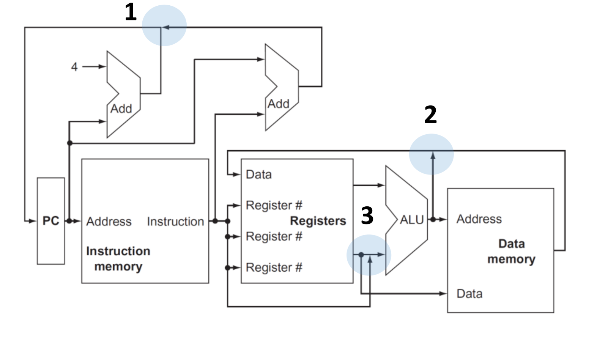

# Useful notes for Computer Architecture oral exam

## README

Before starting:

- I'm writing these notes BEFORE the exam, using the slides the professor gave us, trying to find those arguments that are more likely to be asked during the oral exam;
- Feel free to add anything you think is useful;
- After your exam, please add any question you remember, so that we can help future students.
- Thanks to [Federico Casu](https://github.com/federic0casu) who wrote the [notes](https://github.com/b0-n0-b0/Computer-Engineering/blob/main/FIRST_YEAR/SECOND_SEMESTER/Computer_Architecture/Computer_Architecture_Notes.pdf) from which I took inspiration;

## How to read effectively these notes

- directly from github: won't be able to see some math formulas and symbols, formatted in LaTeX;
- pdf version: all symbols and formulas are correctly formatted, but I don't optimized the layout, so images can float in the page.
- VSCode with Markdown Preview Enhanced: the best option. I wrote these notes using this extension, so you can see all the formulas and symbols correctly formatted, and the layout is optimized. Link to the extension: [Markdown Preview Enhanced](https://marketplace.visualstudio.com/items?itemName=shd101wyy.markdown-preview-enhanced)

## Wire delay problem - Slide "Performance part 1"

We first define what a **clock cycle** is: the time between two consecutive rising edges of the clock signal. The actual time is defined by different parameters, such as time-of-flight, gate delay, and setup time.


Clock delay is a phenomenon where the same clock signal arrives at different components at different times, affecting the system's operation.

The larger fraction of the clock cycle is spent on the wire delay, which is the time it takes for the signal to travel from one component to another: this is a problem because the wire delay is proportional to the distance between the components, and the distance between components is increasing; this increases the power consumption and the time it takes for the signal to travel.

## Classes of computers - Slide "Performance part 1"

- IoT devices: devices in everyday life, such as smartwatches, smart thermostats, etc, connected to internet. **The ability to run third-party applications is the line between non-embedded and embedded systems**. They offers useful data and local services to remote applications, using remote information and resources. Wide range of performances and costs. In general, we want to reach required performances with the lowest cost possible;
- Personal Mobile Devices: smartphones, tablets, etc. They have limited power consumption, due to battery life and absence of cooling systems. Key aspects are efficient use of energy, and the memory optimization;
- Desktop computers: spanning from low-cost to high-performance machines, market is driven to *price-performance ratio*. Performance evaluation is challenging, because of the large use of web applications; they also are considered the **access point to data to cloud services**;
- Servers: backbone of large-scale computing. Main points are **availability**, **scalability** and **efficient throughput**. They are used for web services, data storage, etc;
- Clusters/Warehouse-scale computers: collections of desktops/servers, connected to the same network, acting together as a single computer, communicating through the network. Main cost for these systems is the **power consumption and cooling**.

## Defining a computer architecture - Slide "Performance part 1"

Functional requirements for computer architecture can be influenced by market and product competition. Specific features inspired by the market, such as the availability of software for a particular instruction set architecture, can drive the choice of functional requirements.

For each class:

- Personal mobile devices require real-time performance for graphics, video, and audio, as well as energy efficiency;
- General-purpose desktops require balanced performance for a range of tasks, including interactive performance for graphics, video, and audio;
- Servers require support for databases and transaction processing, enhancements for reliability and availability, and support for scalability;
- Clusters/warehouse-scale computers require throughput performance for many independent tasks, error correction for memory, and energy proportionality;
- Embedded computing often requires special support for graphics or video, power limitations and power control, and real-time constraints.

### Software compatibility

- at programming language: more flexibility, but need new compilers and interpreters.
- object code: instruction set already defined, little flexibility but no need for investment in software.

### OS requirements

- Size of address space: important because it may limit some applications.
- Memory management (paging, segmentation, etc);
- Protection: derives from the previous point;
- Virtualization: memory management and protection are key points;

## Flynn's Taxonomy - Slide "Performance part 1"

- **SISD**: Single Instruction, Single Data. Uni-processor systems.
- **SIMD**: Single Instruction, Multiple Data. Vector processors, GPUs.
- **MISD**: Multiple Instruction, Single Data. Is the logic behind the pipeline.
- **MIMD**: Multiple Instruction, Multiple Data. Multi-core processors, clusters.

## Parallel architectures

Different classes of parallel architectures:

- Instruction level parallelism (ILP): multiple instructions executed in parallel (pipeline and speculative execution).
- GPU: single instruction applied to a collection of data in parallel.
- Thread level parallelism (TLP): multiple threads executed in parallel.
- Request level parallelism (RLP): multiple requests executed in parallel.

Tightly coupled MIMD exploit TPL, where cooperative threads are executed in parallel. Loosely coupled MIMD exploit RLP, where independent tasks can proceed in parallel, needed only limited communication.

## Comparison between CPU and memory performance - Slide "Performance part 1"

WHile CPU performance has been increasing, memory performance has been increasing at a slower rate. Taking as reference an Intel i7 CPU, we can reach a peak bandwidth of 400 GB/s, while the memory bandwidth is 25 GB/s. This is a problem, because the CPU is not able to reach its peak performance due to the memory bottleneck. This bandwidth can be reached by exploiting various techniques:

- multi-porting and pipelining cache accesses;
- use multiple cache levels;
- using different caches for data and for instructions;
- implementing different caches for each core;

## Dependability - Slide "Performance part 1"

Dependability is the ability to deliver service that can justifiably be trusted. Infrastructures provides SLA (Service Level Agreement) to guarantee the service, or simply check if a system is up and running. Other software resources can be used to check the system's status:

- error detection: parity, checksums, CRCs;
- system reconfiguration: hot swapping, hot standby;
- system recovery: checkpoint, rollback, re-execution;

### Fault tolerant system design

- **Error detection**: when a fault is present, it may leads to an incorrect operation state. There is a distance between the error and the incorrect state:
  - **temporal distance**: time between the fault and the error. If I don't use a certain component, I can't detect the error: periodic checking is needed;
  - **spatial distance**: space between the fault and the error;
- Reconfiguration and recovery: when a fault is detected, the system must be reconfigured to avoid the error. The reconfiguration can be **hot** (while the system is running) or **cold** (system is stopped). Recovery can be **rollback** (return to a previous state) or **re-execution** (re-execute the operation).

### Reliability

- Mean time to failure (MTTF): average time between two failures.
- Mean time to repair (MTTR): average time to repair a failure.
- Mean time between failures (MTBF): average time between two failures, considering the repair time. Is the sum of MTTF and MTTR.
- Availability: ratio between the time the system is up and running and the total time. Is the fraction between MTTF and MTBF.

### Redundancy

We can cope with failure by using redundancy. There are different types of redundancy:

- in time: redo the operation to check if the result is still erroneous;
- in resources: use multiple modules to perform the same operation;

## Measuring performance - Slide "Performance part 2"

Typical metrics to measure performance are the **throughput** and the **response time**. The throughput is the number of tasks completed per unit of time, while the response time is the time between the submission of a task and the completion of the task.

Dealing with execution time, two are the possible approaches:

- **wall clock time**: the time between the start and the end of the task, including all the system overhead;
- **CPU time**: the time the CPU is actually working on the task.

Whatever the approach, we can define the **speedup** as the ratio between the execution time of the system $X$ and the execution time of the system $Y$. When we state that a system is $n$ times faster than another, we are referring to the speedup.

### Benchmarking

To measure the performance of a system, there are some tests that can be performed:

- **kernels**: small programs that test a specific feature of the system, such as matrix multiplication;
- **toy benchmarks**: small programs that test the system's performance in a specific task, such as sorting algorithms;
- **synthetic benchmarks**;
- **benchmark suites**: collection of benchmarks that test the system's performance in a wide range of tasks.

This approach can be affected by some biases:

- compiler can recognize the benchmark, and optimize the code in order to artificially increase the performance;
- the conditions in which the benchmark is executed can affect the performance.

To avoid this inconvenience, no code modifications should be allowed, except for the essential ones that produce the same output.

Benchmarks are prepared by organizations, such as SPEC, that provide a set of benchmarks to test the system's performance, specifically for a target systems, such as servers, desktops, IoT devices, etc.

## Deal with performance while defining a Computer Architecture - Slide "Performances part 2"

Some useful equations:

$$\text{CPU time} = \text{CPU Clock Time for a program} \times \text{Clock cycle time} = \frac{\text{CPU Clock Time for a program}}{\text{Clock rate}}$$

$$\text{CPI} = \frac{\text{CPU Clock Time for a program}}{\text{Instruction count}}$$

$$\text{CPU time} = \text{Instruction count} \times \text{Cycles per Instruction} \times \text{Clock cycle time}$$

$$\frac{\text{Instruction}}{\text{Program}} \times \frac{\text{Cycles}}{\text{Instruction}} \times \frac{\text{Seconds}}{\text{Cycle}} = \frac{\text{Seconds}}{\text{Program}} = \text{CPU Time}$$

Different instructions types have different CPIs, and the CPI is the sum of the CPIs of the different instructions types.

## Principles of Computer Design - Slide "Performance part 2"

### Parallelism

Take advantage of **parallelism**: multiple processors, disks, pipelines, multiple functional units. It's important to **design efficient parallel solutions**. This is achieved by:

- ensuring load balancing of each component;
- minimizing communication overhead. This include both:
  - time spent in **communication**, such as data transfer, synchronization, etc;
  - time spent in **managing the parallelism**, such as scheduling, distributing tasks, etc;

### Principle of locality

- temporal locality (if an instruction is executed, it is likely to be executed again) ;
- spatial locality (if an instruction is executed, the next instruction is likely to be executed).

### Amdahl's Law [Professor explicitly says that this could be an exam question]

An important think to take in consideration is **focus on the common case**: this include both its **identification** and **optimization**. Here comes in help Amdahl's Law, that states that the speedup of a system is limited by the fraction of the system that can't be parallelized. The speedup is given by the formula:

$$\text{Speedup} = \frac{\text{Execution time of the system without the enhancement}}{\text{Execution time of the system with the enhancement when possible}}$$

- **fraction enhanced** is the fraction of computation time in the original solution than can be converted to the enhanced solution;
- **speedup enhanced** is the improvement gained by the enhancement.

The last term of the formula is given by:

- execution time for a fraction of a task without the enhancement;
- execution time for the same fraction of the task with the enhancement;

Mathematically speaking:

$$(1-\text{fraction enhanced}) \times T_{\text{old}} + \frac{\text{fraction enhanced} \times T_{\text{old}}}{\text{speedup enhanced}}$$

So the formula or the speedup becomes:

$$\text{Speedup} = \frac{1}{(1-\text{fraction enhanced}) + \frac{\text{fraction enhanced}}{\text{speedup enhanced}}}$$

Look at this table as an example:

| Solution | Fraction enhanced    | Computing time | I/O time | Overall time |
|----------|----------------------|----------------|----------|--------------|
| Original | ...                  | 7s             | 3s       | 10s          |
| Disk     | I/O speedup 3x       | 7s             | 1s       | 8s           |
| CPU 1    | Computing speedup 2x | 3.5s           | 3s       | 6.5s         |
| CPU 2    | Computing speedup 3x | 2.33s          | 3s       | 5.33s        |

- Disk: fraction enhanced is 0.3, speedup enhanced is 3, so the speedup is 1.25;
- CPU 1: fraction enhanced is 0.7, speedup enhanced is 2, so the speedup is 1.54;
- CPU 2: fraction enhanced is 0.7, speedup enhanced is 3, so the speedup is 1.87.

### Take advantage of asynchronous operations

This aspect is fundamental in networked systems, where the time to send a message is much higher than the time to execute the operation: we should design systems in order to increase the number of asynchronous operations, covering the delay introduced by the network with other operations.

This method is also applied trough the **speculative execution**, where the system executes an operation before it is actually needed, in order to cover the time needed to execute the operation.

## The CPU, from instruction set to the architecture - Slide "CPU - part 1"

> I expect that possible questions for this topic may be like "Take this instruction, and talk about which components of the CPU circuit involves", or "Explain the function of this component, and its properties"

### Read an instruction from memory

The state elements to read an instruction from memory are the **instruction memory** and the **program counter**. Memory has to be **read-only**, because data path does not need to write on it. The program counter is a register that contains the address of the next instruction to be executed, and it's written at the end of a clock cycle, thus it doesn't need to a write control signal.

The output of the entire operation reflects, at any time, the content of the program counter, so no additional control signal is needed.

### ALU operations

To do ALU operations, data are needed. For this reason, a **multiported register file** is used: it contains all the registers, and it has **two read ports**, to read the two operands, and **one write port**, to write the result. It always outputs the content of a given register, so no additional control signal is needed. On the contrary, the write port is controlled by the **write control signal**: it is **edge-triggered**, so the write operation is performed at the end of the clock cycle. This unlock the possibility to read and write on the same register in the same clock cycle: read will output the old value, write will write the new value. Wires in input to the register file are:

- **a 5-bit wire** to specify the target register;
- **a 64-bit wire** to specify the value to be written, because the register files are 64-bit wide.

For what regards the ALU, it has:

- **a 4-bit wire** to specify the operation to be performed;
- **two 64-bit wires** to specify the two operands;
- **one 64-bit wire** to output the result;
- **one wire** to specify if the result is zero.

The partial CPU is shown in the following image:


### Increment the program counter

Given the fact that instructions always have to be **aligned to 8 bytes**, an ALU is used, whose inputs are the program counter and a fixed value of 4, and the output is the address of the next instruction, which directly goes to the Program Counter.

### Edge-triggered clocking methodology

In general, clock methodology defines when the signal can be red and written. In edge-triggered clocking, any element can be updated only on a clock transition, and they are available for operations on the next clock cycle.

Take two state elements, surrounded by combinatorial logic, which operated in a single clock cycle. For this very reason, all signals from first element to the second one must be transmitted within a clock cycle; the maximum time needed to transmit a signal will define the length of the clock cycle.

#### D flip-flop rising edge-triggered

Master-Slave structure:

- Master is open and follows the input signal when the clock is high;
- when the clock falls, Master is closed and the slave, which is open, takes as input  output of the master.

### Pipeline data transfer

- **Asynchronous pipeline**: data are transferred from one stage to the next one when they're ready, using an **ACK signal** to confirm they have been received. When a stage finishes, it asks for new data to the previous stage using an handshake protocol.
- **Synchronous pipeline**: data are transferred from one stage to the next one when the clock signal is high. Data must be stable at the clock edge, which have to consider the time of the slower stage.

Asynchronous pipelines are more flexible and faster, but they are more complex to design and to test, due to need of additional logic; synchronous pipelines are easier to design and to test, but they are slower.

To implement synchronous pipelines, latches are used, with an edge-triggered methodology: in this way clock signal activates all the staging latches simultaneously. An issue that arises while using latches is signal may be unstable during the clock edge, so designers should implement logic to keep the output stable until the next period of latch transparency.

It's also possible to implement an asynchronous pipeline exploiting the clock: this methodology is used in industrial plants to reduce the effects of capacitative couplings and electromagnetic disturbance on the transfer.

### Instruction: $\texttt{CBZ X1, offset}$

**C**ompare **B**ranch **Z**ero is an ARM Assembly instruction, that tests if the content of register X1 is zero, and if it is, it jumps to the instruction at the address given by the sum of the program counter and the offset. To implement the instruction, we have to compute the target address by adding the sign-extended offset to the program counter; moreover, offset field is shifted left by 2 bits, to align to a word boundary. In this way, the range of addresses that can be reached is increased by a factor of 4.

- a comparison between 0 and the content of X1 is performed by the ALU;
- target address is computed by the ALU;
- if the comparison returns true, the target address is written in the program counter.
- else, the program counter is incremented as usual.

So two main operations are performed.

### Instruction: $\texttt{ADD X1, X2, X3}$

This instruction adds the content of register X2 and X3, and writes the result in register X1. The operation is performed by the ALU, and the result is written in register file. Three operands are involved, two read and one write, so the existence of this operation justifies the need of a multiported register file.

### Instruction: $\texttt{LDUR X1, [X2, offset]}$

The instruction computes a memory address, by adding base register X2 to the 9 bit signed offset, contained in the instruction, and reads the content of the memory at that address. The content is then written in register X1.

Modules involved in the operation are:

- the register file, to read the base register, and write the result;
- the ALU, to compute the sum,
- the memory unit, to read the content of the memory.
- sign extension unit, to extend offset to 64 bits.

### The main control unit



Points signed with 1, 2, and 3 underline the fact that different outputs *merged* in the same wire: in reality, a multiplexer is added in order to always select the right output for the right operation.

The main control unit is responsible for this operation: knowing which instruction is being executed, it send an appropriate signal to every multiplexer involved in the operation. The integration of its circuit is shown in the image above.


- select the right code to be passed to the ALU, to perform the right operation;
- set write control signal to the register file,;
- set multiplexer to correctly write into register file:
- set multiplexer to correctly write into the program counter;
- set signals to read and write from memory

### Instruction format

The first principle to have in mind id **simplicity favors regularity**: instruction format should be as simple as possible, to make the decoding process easier.

- first register operand is always in position $[9:5]$ for both R-type, load and store instructions;
- the other register operand is always in position $[20:16]$ for R-type instructions, and in position $[4:0]$ when is the destination register;
- another operand can also be a 19-bit offset, for compare and branch 0-bit, or a 9-bit offset for load and store instructions;
- destination register for R-type instructions and for loads is always in position $[4:0]$;

These information are used by the main control unit to set multiplexers and ALU.

### Instruction execution

These are the phases of an instruction execution:

- fetch instruction from memory;
- decode the instruction and read registers;
- execute the instruction;
- access memory, if needed;
- write the result into a register (if necessary).

> In the slides, execution of the 3 previous instructions has been described. I won't go into details because I think it's possible to describe with ease the execution of any instruction, given the information above. However, if you want more details, in particular for how the CPU circuit is involved, feel free to look at the slides.

## Why a single cycle CPU is not feasible - Slide "CPU - part 2"

Looking at the previous circuit, let's identify the longest path in the circuit, in order to determine the clock cycle.

- Store and Load executions use 5 functional unities in series (instruction memory, register file, ALU, data memory, register file);
- ADD uses 4 functional unities in series (instruction memory, register file, ALU, register file);
- CBZ also uses 4 functional unities in series (instruction memory, register file, sign extension, ALU).

Although the CPI is 1, the overall performance of a single-cycle implementation is likely to be poor, since the clock cycle is too long. This is due to the fact that the longest path in the circuit determines the clock cycle, and the clock cycle must be long enough to allow the slowest path to complete.

## Pipelining - Slide "CPU - part 2"

Pipelining is a technique used to increase the throughput of a CPU, by allowing multiple instructions to be executed in parallel. The idea is to divide the execution of an instruction into multiple stages, and to execute multiple instructions in parallel, each at a different stage.

Using a synchronous pipeline, the clock causes all output to be transferred to the next units, so since it occurs at fixed intervals, we have to consider the time needed to complete the slowest stage.

We can experimentally measure a certain speedup for the total time of execution for a group of instructions, but on the contrary, the time needed to execute a single instruction is increased, because of the fixed time needed to complete the slowest stage, which slows down the fastest stages.

The results can be seen in the following picture:


## Pipeline hazards - Slide "CPU - part 2"

- write-back stage, where the result of the operation is written in the register file, interfering with the execution of another instruction;
- the selection of the next value for Program Counter, choosing from the incremented PC and the branch address possibly calculated during the execution.

### Structural hazards

Hardware cannot support the combination of instructions that, in the same clock cycle, want to use the same hardware functional unit: suppose we had a sigle memory, instead of two: if the pipeline had a fourth instruction, we'd see that in the same clock cycle: the first instruction is reading from memory, and the fourth is fetching another instruction. WIthout two memories, Instruction and Data memory, the pipeline could have a structural hazard.

We define structural hazard as a situation where two instructions are trying to use the same hardware resource at the same time.

Sometime is not possible to have multiple instances of the same hardware resource, so, in these cases, a stall of the pipeline is accepted.

### Data hazards

Occurs when pipeline must be stalled because one step has to wait for another to complete, because of a data dependency between the two instructions. For example, consider the following two instructions:

```assembly
ADD X1, X2, X3    #X1 is the destination register
SUB X4, X1, X5    #X1 is the source register
```

Without intervention, a **data hazard** will occur, stalling the pipeline. We'll waste three clock cycles, because the second instruction will write the result only in the fifth stage.

How to resolve this issue? **Forwarding**: we don't actually need to wait for the entire instruction to be completed, but only for the result to be written in the register file. We can forward the result directly from the ALU to the ALU, so that the second instruction can be executed in the next clock cycle. This is done by adding some multiplexers in the circuit, to select the right input for the ALU.

However, this solution cannot be applied for a **load-use hazard**, where the second instruction uses the result of the first instruction, which is a load instruction. In this case, we have to stall the pipeline, because we don't know the result of the load instruction until the fifth stage.

Another solution, not always applicable, to resolve data hazards is to reorder the instructions, so that the second instruction is executed before the first one. As reference:

```c
a = b + e;    # ADD X3, X1, X2
c = b + f;    # STUR X3, [X4, #24]
```

We can swap the two instructions, so that the second instruction is executed before the first one. This is possible because the two instructions are independent, and the result of the second instruction is not used by the first one.

### Control hazards and branch prediction

These hazards arise from the need to decide the next instruction to be executed, basing this choice on the result of the current instruction, changing the flow of the program. The problem is that the decision is taken only at the end of the execution of the instruction, so the pipeline must be stalled until the decision is taken.

**Prediction** is the key to resolve this issue: the simple solution is to always choose the conditional branch, letting the pipeline to run at full speed; in this case, only when the branch is not taken the pipeline stalls. This is called **static prediction**.

In reality, a **dynamic prediction** is used, based on the history of the branch. Accuracy can reach 95%, and the pipeline stalls only when the prediction is wrong: when this case occurs, pipeline control must ensure that the instructions that have been executed won't affect the final result, and that the pipeline can be restarted from the correct instruction.

Deeper pipeline will have severer penalties for a wrong prediction, because the pipeline will have to be restarted from the beginning: for this very reason, modern processors don't have a deep pipeline; the known processor with the deeper pipeline is the Intel Pentium 4, with 31 stages, but its performance was poor and it was quickly abandoned.

Strategy used: a table is built, look up at the address of the instruction, and check if exist a previous execution of the same instruction and, if so, begin fetching new instructions from the same place of the last time (typical case of a loop). If the prediction appears to be wrong, the entry in the table is updated.

## Pipeline datapath and control - Slide "CPU - part 2"

To store the partial results of the operations within the pipeline, **pipeline registers** are used:


### $\texttt{LDUR}$ instruction

> In the slides, execution with pipeline is described. It only differs from what seen before for the fact that the partial result is stored in the pipeline registers. The only thing worth to mention is the write-back stage, where the result is written in the register file: given the fact that there are no pipeline register for this final stage, the result is written in the register file only at the end of the clock cycle. How? First of all, we need to preserve the destination register used in the fetched instruction: to allow this, it is passed from the $\texttt{ID/EX}$ register to the $\texttt{MEM/WB}$ pipeline register used in the write-back stage, similar to how store passes the register value from the $\texttt{EX/MEM}$ register to the $\texttt{MEM/WB}$ register in the $\texttt{MEM}$ stage: this ensures that the correct register is updated with the loaded data during the write-back operation.

### Recap for pipeline stages

Assume that PC is written on each clock, so no separated signal is needed; the same held for the pipeline registers, that are written on each clock.

1. **Instruction fetch**: the control signals to read an instruction from memory and to write the Program Counter, so no special signal is needed.
2. **Instruction decode**: we need to select the correct register, so signal Reg2Loc is needed, that reads bits $[20:16]$ for R-type instructions, and $[4:0]$ for the destination register.
3. **Execution/Address calculation**: we need to select the correct operation for the ALU, so signal ALUOp is needed.
4. **Memory access**: signals Branch, MemRead and MemWrite are needed to select the correct operation for the memory unit.
5. **Write-back**: two control lines are needed. MemToReg, which decides between sending the ALU results or the memory results to the register file, and RegWrite, which decides if the result has to be written in the register file.

## Interrupts and exceptions - Slide "CPU - part 2"

We define as exception any unexpected change in control flow, without distinguishing between the cause of the interruption. Specifically, we define as **interrupt** an exception caused by an external event.

When an exception occurs, CPU must save the address of the instruction into the Exception Link Register, and then transfers the control to OS at a specific address. It performs some actions, such as services for user, and then it can terminate the previous program (in case of a fatal error) or resume its execution, using the address saved in the ELR. This behavior can be determined only if the OS knows the **reason of the exception** and the address of the instruction that caused it. Two methods can be used to achieve this:

- **single entry point**, with the OS that decodes the status register to understand the reason of the exception;
- **vectored interrupts**: an index is used to refer to a table of addresses, where each address is the entry point for a specific exception.

From the pipeline point of view, an interruption is seen as a control hazard, where the branch need to be flushed, and the address of the next instruction to be executed is changed.

The circuit to manage the interruption is shown in the following image:


1. retrieve the address of the first instruction of the exception handler;
2. flush the $\texttt{ID/EX}$ section;
3. flush the $\texttt{EX/MEM}$ section;
4. write the exception information in the status register $\texttt{ESR}$ e \texttt{ELR}.

## Instruction Level Parallelism - Slide "CPU - part 2"

Recap on techniques to accelerate single core performance:

| Technique        | Description                                                 | Limitation                                           |
|------------------|-------------------------------------------------------------|------------------------------------------------------|
| Pipelining       | Divide the execution of an instruction into multiple stages | Issue rate, stalls, depth of pipeline                |
| Super-pipelining | Inter-clock cycle pipelining                                | Clock skew, slower ALU, stalls                       |
| Super-Scalar     | Execute multiple instructions in parallel                   | Hazard resolution (even with compiler)               |
| VLIW/EPIC        | Each instruction specifies multiple scalar operations       | Packing                                              |
| Vector           | Execute the same operation on multiple data                 | Data dependency, data alignment, AVX extensions, GPU |

### Static vs Dynamic issue

Static multiple issues processors partially rely on the compiler to determine the number and sequence of instructions that can be issued in a clock cycle, while dynamic multiple issues processors use the hardware to determine it at runtime. Static issue systems rely on the compiler to handle data and control hazards, while dynamic ones use hardware techniques to alleviate these hazards at execution time.

### A design for embedded systems

Some embedded systems are able to issue two 64-bit instructions per cycle, using a specific design. To simplifying decoding and issuing, these processors restrict the layout of simultaneously issued instructions, requiring paired and 64-bit aligned instructions, with the ALU or the branch portion to appears first. If an instruction cannot be used, it is replaced with a NOP.

Static multiple-issue processors may vary in how they manage data and control hazards, relying on compiler or hardware techniques to handle these hazards. In contrast, dynamic multiple-issue processors use hardware techniques to alleviate these hazards at execution time. Hazards often force the entire issue queue to stall, which can be costly in terms of performance: this reinforce the appearance of a large single instruction with multiple operations.

### Super-scalar processors

In the simplest super-scalar processors, the processor decides how many instructions to issue in a clock cycle, given a liste of ordered instructions. Achieving good performance also depends on the capacity of the compiler to schedule instructions to avoid hazards and dependencies between instructions. Furthermore, there is no need to recompile the code to take advantage of the multiple issue capabilities of the processor, while some VLIW processors require the code to be recompiled when moved across different processors models.

Dynamic pipeline scheduling chooses which instructions to execute next, possibly reordering them in order to avoid stalls; pipeline is divided into three major modules: instruction fetch and issue unit, multiple functional unit and a commit unit. In this way instructions are performed **asynchronously**, and in parallel. The order is guaranteed in the commit unit, exploiting the dynamic scheduling, which offers some advantages:

- don't need a specific compiled version for a specific pipeline;
- can handle those dependencies that are unknown at compile time;
- allow the processor to tolerate unpredictable events, such as cache misses, executing other instructions in the meantime.

The schema of a super-scalar processor is shown in the following image:


- the first unit retrieves the instructions **in order**, and send them to the corresponding functional unit;
- each unit has a **reservation station**, where the instruction is stored until all the operands are available. When all the operands are available, the instruction is sent to the functional unit and the result is calculated. Here the execution is **out of order**;
- the result is then sent to the commit unit, and it stays there until the instruction is committed;
- the buffer in the commit unit is called **ReOrder Buffer**, and it is used to store the results of the instructions, in order to commit them in the right order.

### Register renaming

In a super-scalar processor, number of registers is increased, in order to avoid data hazards as much as possible. This is done by renaming the registers, so that the same register can be used by multiple instructions at the same time. This is done by the **Reorder Buffer**, which stores the results of the instructions, and the **Register Alias Table**, which stores the mapping between the physical registers and the logical registers. This technique is particularly useful when the same register is used by multiple instructions at the same time, but without an actual data dependency. For example:

```assembly
ADD X1, X2, X3
ADD X4, X5, X1
```

In this case, the second instruction can be executed in parallel with the first one, because result of the first instruction is not used by the second one. This is possible because register X1 is renamed, and the result of the first instruction is stored in a different register.

Thus, these operations:

```assembly
OP R1, R2, R3
OP R3, R2, R4
OP R4, R3, R5
OP R2, R4, R3
OP R3, R2, R6
```

became:

```assembly
OP R1*, R2*, R3*
OP R3*, R2*, R4*
OP R4*, R3*, R5*
OP R2*, R4*, R3**
OP R3**, R2*, R6*
```

This is possible because the number of physical register is much higher than the number of logical ones (1k vs 64); why don't we have the same number of physical and logical registers? Because the number of physical registers is limited by the number of bits used to address them: the number of bits reserved for the register address is limited and predefined, so the number of logical (also called **architectural**) registers is limited.

A table is used to store the mapping between the physical and the logical registers, and it is called **Register Alias Table**. This table is used to store the mapping between the physical and the logical registers, and it is used to rename the registers. The table is updated every time an instruction is committed, and the physical register is freed.

### Speculative execution

Speculative execution is a technique used to increase the performance of a processor, by executing an instruction before it is actually needed. This is done by predicting the outcome of a branch, and executing the instructions that follow the branch before the branch is actually executed. If the prediction is correct, the processor can continue the execution without any problem; if the prediction is wrong, the processor **must discard the results** of the instructions that have been executed, and restart the execution from the correct instruction.

```c
if (x > 3){
  instruction_1;
  instruction_2;
} else {
  instruction_3;
  }
instruction_4;
```

The processor starts to execute instruction of both branches and, in the commit phase, looks at the result of the compare instruction to decide which branch to commit, deleting all the effects of the other branch. Note that:

- if an instruction has to raise an exception, this is not raised until the instruction is committed;
- the rollback of the wrong branch doesn't leave traces in the architecture; however, it can leave traces in the $\mu$-architecture, such as the cache. Look at the Spectre and Meltdown vulnerabilities for more information (just named during the lesson).

## Multithreading - Slide "CPU - part 2"

A thread is like a process, with its own state and program counter, but it shares the same memory space with other threads. Hardware threads permit *virtual* threads to share the same resources, such as the cache, the functional units, etc, using the same physical processor. Obviously, hardware must support this feature, and the OS must be able to manage them: while change of context between processes can cost few thousands of cycles, change of context between threads can be instantaneous.

### Coarse-grained multithreading

When a costly stall occurs, such as L2 or L3 cache miss, the processor can switch to another thread, and continue the execution of the other thread. This is called **coarse-grained multithreading**, and relieves the fact that the time to switch between threads is almost negligible compared to the occurred stall. The main limitation of the model is the start-up cost of the pipeline, which is not negligible: for this reason, the coarse-grained multithreading is used only for long stalls. To better understand the concept, look at the following image:


### Fine-grained multithreading

In this technique, switches between threads are made after each instruction, resulting in a **interleaved execution** of multiple threads. Round-robin scheduling is used, in order to skip any thread that is stalled at that clock cycle, and guarantee execution of every scheduled thread. The main advantage of this technique is that it can hide the throughput loss due to both long and short stalls, but the main disadvantage is that it slows down the execution of a single thread, because the pipeline is shared among multiple threads. An image that shows the concept is shown below:


### Simultaneous multithreading

This is a variation of fine-grained multithreading, that arises naturally when fine-grained multithreading is implemented on top of a multiple-issue dynamically scheduled processor. It exploits thread-level parallelism to hide long-latency events, increasing the usage of the functional components. Techniques such as register renaming, and dynamic scheduling allow multiple instructions from independent threads to be executed without regards of dependencies among them. The follow image offers a visual representation of the typical execution:


If applied in a out-of-order processor, *per-thread tables* for register renaming and separate PCs are used to avoid conflicts between threads and, at the same time, to increase the performance of the processor.

## Intel i7 architecture - Slide "CPU - part 2"

The Intel i7 architecture is a 64-bit architecture, 64-bit-wide address space, and a 64-bit data path. It leverages **CISC** instructions set, so:

- variable-length instructions;
- complex semantics;
- variable execution time;
- complex addressing modes.
- numerous accesses to memory.

However, at $\mu$-architecture level, the processor is a **RISC** processor.

We'll analyze the operation needed to execute a single instruction, referring its actual architecture.


### Instruction fetch

Process uses a complex **multilevel branch predictor**, to achieve balance between speed and prediction accuracy (a wrong prediction causes a penalty of 17 cycles), and a **return address stack** to speedup functions return. The unit is able to fetch 16 bytes from the instruction cache.

### Instruction decode

The fetched 16 bytes are placed in the **pre-decoded instruction buffer**. These can be fused into a single instruction under certain condition, such as compare and branch, but they're able to speedup performance up to 10%. In every other case, instructions are split into individual x86 instructions, and placed in the **instruction queue**.

### $\mu$-operation decode

The x86 instructions placed in queue are translated into $\mu$-operations: they are simple RISC-V instructions, executable directly by the pipeline. The i7 has three simple decoders, and a complex decoder for those instructions that are translated into an equivalent sequence. Once translated, the $\mu$-operations are placed in 64-entries **$\mu$-operation buffer**.

### Loop stream detector

A **loop stream detector** is used to detect loops, directly issuing $\mu$-operations from the buffer, avoiding the use of the instruction fetch and decoder. $\mu$-fusion combines instructions and send them into the same reservation station, increasing buffer usage. Experimental measurements show up that these fusions produce smaller gains when dealing with integer operations, and larger gains when dealing with floating-point operations.

### Basic instruction issue

The process is similar to the one seen in the previous sections; up to four $\mu$-operations can be issued in a single clock cycle, and they are sent to the first Reorder Buffer available.

### Reservation stations

The processor uses a centralized reservation station, shared by six functional units, thus up to six $\mu$-operations can be issued in a single clock cycle. The reservation station is used to store the $\mu$-operations until all the operands are available, and then they are sent to functional units.

### $\mu$-operation execution

Operations are executed by the single function units, and the results are sent back to any waiting reservation station, where they'll update the register as soon as the instruction is no longer speculative. At that time, the entry corresponding to the instruction in the Reorder Buffer is marked as completed.

### Commit

When instructions are marked as completed:

- pending writes in the register retirement unit are executed;
- entry in the Reorder Buffer is removed.

## ARM Cortex-A53 architecture - Slide "CPU - part 2"

The ARM Cortex-A53 is a 64-bit processor, with a 64-bit address space, and a 64-bit data path, using a RISC instruction set. The CPU schema is the following:


### Instruction fetch phase

The **AGU** (Address Generation Unit) is used to calculate the address of the next instruction, exploiting Hybrid Predictor, Indirect Predictor, and Return Stack Predictor, in order to keep instruction queue as full as possible. The instruction cache is 32KB, it has 13 entries and it can fetch 64 bytes per cycle. The first three Fetch stages fetch instructions, while the fourth one includes an address generator that produces the next PC either by incrementing the last PC, or from one of the predictors.

Target cache is checked during the first cycle: if it hits, then the next two instructions are fetched from target cache, executing the branch without delays.

### Decode phase

D1 and D2 are for basic decoding, while D3 is used for complex ones, and it's overlapped with the first stage of execution pipeline.
After ISS, the Ex1, Ex2 and WB stages completes integer pipeline.
The floating-point pipeline is 5 cycle deep, that sums up to the 5 cycles for fetch and decode, resulting in a 10-cycle latency for floating-point operations.

Decode stages determine if there are dependencies between instruction, forcing a sequential execution in that case.

### Execution phase

The execution section occupies three pipeline stages, providing one pipeline for instruction load, one for store, two for ALU operations, and separate pipelines for integer multiplication and division. The floating-point and SIMD operations add two more stages to the pipeline, and also a pipeline for domain-specific operations (square root, etc).

### Power saving instructions

- **WFI** (Wait For Interrupt) instruction stops the processor until an interrupt is received;
- **WFE** (Wait For Event) instruction stops the processor until an event is received;
- **SEV** (Send Event) instruction sends an event to another processor.

## JTAG - Slide "CPU - part 2"

Device used during the debugging phase of a microprocessor, when there is no OS running. It takes out bit streams from the registers in a predefined order, and at the same time it inserts bit streams in the desired registers, such as new address in the PC, new data in the registers, etc.

## Introduction - Slide "Cache - part 1"

The cache is a small, fast memory, used to store the most frequently used data, in order to reduce time needed to access the main memory. The cache is divided into **cache lines**, which are the smallest unit of data that can be stored in cache. The cache is divided into **cache sets**, which are groups of cache lines, and each cache set is divided into **ways**, which are the number of cache lines that can be stored in the same set.

### Principles of locality

- **Temporal locality**: if a data are accessed, it is likely to be accessed again in the near future. Keeping most recently accessed data near the processor can reduce time needed to access the data.
- **Spatial locality**: if a data are accessed, it is likely that nearby data will be accessed soon. Moving data from main memory closer to the processor can reduce time needed to access the data.

### Terminology

- **block**, or **line**: smallest unit of data that can be stored within the cache;
- **hit rate**: fraction of memory accesses founds in cache;
- **miss rate**: fraction of memory accesses not found in cache. Also calculated as $1 - \text{hit rate}$;
- **miss penalty**: time needed to fetch a block from the main memory;

### Mapping

How do we know if a certain data are in cache? There are different ways to map data:

- **direct-mapped cache**: we use the block address, doing a modulo operation with the number of blocks in cache. Being it a power of 2, we can use the last bits of the address to determine the block in cache. We also add a **tag** to the block, which contains the address of the block in the main memory. The tag is compared with the tag of the block in cache, to see if it is actually present. This method is cheap, but it can lead to a high miss rate, because multiple blocks can be mapped in the same position in cache;
- **fully associative cache**: allows a flexible mapping of the data in cache, because the block can be placed in any position. More expensive, because it requires a comparison of the tag with all the tags of every possible block;
- **set-associative cache**: a compromise between the two previous methods, where cache is divided into sets, and the block can be placed in any position in the set. Only need of $n$ comparators, where $n$ is the number of ways, being less expensive than the fully associative cache.

### How to find the data in cache

For what regards the direct-mapped and the set-associative cache, an index is used: it can be calculated from the memory address of the data and, once accessed in cache, the tag is checked to see if the data are in cache. If the tag matches, the data are in cache, and the data are read from the cache. The validity bit is also checked, to see if the data are valid. Time to check the cache is called **hit time**.

### Miss rate vs Block size

We observe that the miss rate goes up if the block size becomes a significant fraction of the cache size, because the number of blocks that can be held in the same cache size is smaller.

Bigger block size: more spatial locality, but if increased too much until having few blocks in cache, temporal locality is lost; furthermore, the miss penalty is higher because the block is bigger, and more time is needed to fetch it from the main memory.

### Types of cache misses

- **Compulsory miss**: also known as **cold start miss**, occurs when the data are accessed for the first time, and it is not in cache. It is not possible to avoid this kind of miss, because the data has to be fetched from the main memory. A solution to limit the impact of this kind of miss could be to have a bigger block size, to exploit spatial locality, taking in mind that the miss penalty will be higher, and higher block size could lead to a higher miss rate.
- **Capacity miss**: occurs when cache is full, and the data have to be replaced by another ones. This kind of miss can be reduced by increasing the size of the cache, but remember the fact that bigger caches have higher access time, because of the higher **hit time**, which is the time needed to check if the data are in cache.
- **Conflict miss**: occurs when multiple memory locations are mapped in the same cache location. This is what happens: the index of the memory location within cache is computed, and the set is accessed. Then, the validity bit and the address tag are checked. If the validity bit is set, but the tag doesn't match, a conflict miss occurs. This kind of miss can be reduced by increasing the number of ways, or by using a fully associative cache.

## Cache - part 2 - Slide "Cache - part 2"

### Replacement policies

When a block has to be replaced, a replacement policy is used to determine which block has to be replaced. Most common policies are:

- **random replacement**: block to be replaced is chosen randomly;
- **least recently used (LRU)**: block that has been accessed the least recently is replaced. This is the optimal replacement policy, but it is also the most expensive, because it requires a counter for each block, to keep track of the last access time. The counter is updated every time the block is accessed, and the one with lowest counter is replaced;
- **first-in first-out (FIFO)**: the block that has been in cache the longest is replaced. This policy is less expensive than LRU, because it requires only a counter for each set, to keep track of the order in which blocks have been placed in cache.

### Write policies

When a write operation is performed, cache policy decides how to handle the write operation:

- **write-through**: data are written both in cache and in the main memory. This policy is simple, but it is also slow, because the actual operation is itself slow. To speed up that operation, a **write buffer** can be used, to store data that have to be written in main memory. Write buffer is used to speed up write operations, because they're considered completed as soon as the data are written in it;
- **write-back**: data are written only in cache, and the main memory is updated only when the block is replaced. This policy is faster than the write-through one, but it is also more complex: to keep track of which blocks have been modified, a **dirty bit** is implemented: it is set when the block is modified, and it is cleared when the block is written in the main memory; it is also used to avoid writing block in the main memory if it has not been modified.

What happens in case of **write miss**? Two possibilities:

- **write-allocate**: the block is read from the main memory, and then the data are written in cache. This policy is used in combination with write-back, because the block has to be read from  main memory before to write them in cache;
- **write-no-allocate**: the data are written only in the main memory, and the block is not read from the main memory. This policy is used in combination with write-through, because the data are written directly in the main memory, avoiding the hit time and performing immediately the write operation, as the write-through policy requires.

### Load policies

When a load operation is performed, cache policy decides how to handle it:

- **blocking**: processor has to wait until the entire block is in cache, before resuming the execution;
- **non-blocking**: processor can resume its execution in the moment the requested word is in cache, and the other words are fetched in background.

Speaking of **non-blocking** policy, we can have two different implementations:

- **early restart**: words are fetched in order, and the processor has to wait until the requested word is in cache. Example: if the requested word is the third word in the block, the processor wait for the load of the previous ones the the actual one;
- **critical word first**: the requested word is fetched first, and the other words are fetched, sequentially, in background. This policy is more complex, but it is also faster, because the processor doesn't have to wait for the entire block to be in cache.

### Cache performances

Let's assume that cache hit costs are included as part of the normal CPU execution cycle, then we can write:

$$\text{CPU time} = \text{IC} \times \text{CPI} \times \text{CC}$$

where:

$$ \text{CPI} = \text{CPI}_{\text{ideal}} + \text{Memory-stall cycles}$$

Specifically for write-through cache, held the following:

$$\text{Memory-stall cycles} = \text{access/program} \times \text{miss rate} \times \text{miss penalty}$$

Note the impact of hit time in performances: defining **AMAT** as the average time needed to access the memory, we have:

$$ \text{AMAT} = \text{hit time} + \text{miss rate} \times \text{miss penalty}$$

This means that the higher the CPU performances, the higher the influence of hit time on the metric evaluation. Following the same idea, increasing clock rate, the memory stall time will account for more CPU cycle, being it (almost) constant.

In conclusion, **we cannot neglect the cache behavior when we're evaluating system performances**.

### Cache levels

Multiple levels of cache have been defined, driven by the fact that the nearest the cache is to the processor, the faster it is, but also the smaller it has to be. Nowadays, technology allows to have bigger L1 caches, but the principle is still valid. However, design considerations are different for each level:

- **L1** is, has we just said, attached to the processor, and it's the fastest cache. Its will is to minimize hit time, thus its dimension is kept *smaller*, compared to other levels;
- **L2** is bigger, and focuses on serve the L1 cache when a miss occurs. To reduce the time penalty to access memory, it is larger than L1, with bigger blocks, and an high level of associativity

In modern CPUs, out-of-order execution is performed during a cache miss, such as a pending load/store operation; however, this behavior is strongly related to program data flow, which is hard to predict, so we can't measure precisely impact of a cache miss on the CPU performances.

### Victim cache

When necessity to replace a block arises, instead of completely removing it from cache, it is moved to a **victim buffer**, so rather than stalling on a subsequential cache miss, contents of the buffer are checked first, to see if the requested data are there, in order to reduce the miss penalty. Some details about this buffer:

- is even smaller than a L1 cache, having 4 to 16 positions;
- it's fully associative;
- particularly efficient for small direct-mapped caches, showing more than 25% of reduction in miss rate, for a 4kB cache.

### Improving cache performances

#### Misses

Misses depends on the memory access patterns so, from this point of view, cache is a passive element. To improve performances, **code must be optimized**: this includes both an improvement on the behavior of the algorithm, and compiler optimizations for the memory access patterns

#### Reduce hit time

An influent factor is the behavior of write operations:

- **no write-allocate**: we avoid the hit time, but we have to write directly in the main memory. This because the policy obliges to write in memory in any case, so we can avoid the hit time since it's not required to do any operation in cache;
- **write-allocate**: to avoid a waste of cycles, first to check for the hit, and then for write, a **delayed write buffer** is used by the pipeline to write in cache.

Furthermore, the hit time can be improved by using smaller cache (which is the case of L1 caches), implemented with smaller blocks.

#### Reduce miss rate

The miss rate can be reduced by increasing associativity of the cache, so more flexibility is given to it while storing data. Using bigger caches, with larger blocks, can also reduce the miss rate, because the spatial locality is exploited, as we can see in the implementation of L2 cache. We can also combine these hints with the usage of a victim cache, to reduce miss rate.

#### Reduce miss penalty

The miss penalty can be reduced by using smaller block, because the smaller the block, the smaller the data to be fetched from the main memory; a write buffer can also be used, to hold dirty blocks being replaced, diminishing the time needed to read because it doesn't have to wait for the write operation to be completed. Obviously, the write buffer is also used when a read miss occurs: best case is when data are already in the buffer, so we can avoid the miss penalty; if instead data are not in the buffer, no extra time is wasted, because data have to be read from the main memory in any case. We can also consider to use a **fetch critical word first** policy for those larger blocks, to reduce the miss penalty.

Other elements external to the cache can also influence miss penalty, such as bus width, memory speed, and memory controller, so we can consider to improve these elements to reduce the miss penalty.

## Cache - part 3 - Slide "Cache - part 3"

### Direct access cache

A direct access cache is implemented using this schema:


This cache has a size of $2^{14}$ bytes, so $16\texttt{KBytes}$, with a block size of $2^6$ bytes and a word size of $4$ bytes. Using these data, we can compute the number of pages, which is $\frac{2^{32}}{2^{14}} = 2^{18}$, from which also derives the width of the tag field, and the number of blocks in cache, which is $2^{14} / 2^6 = 2^8$.
Here some insights about the cache circuit:

- the tag filed in cache is compared with the bit $[31:14]$ of the address, to see if the data are in cache, and the result is ANDed with the valid bit to return hit or miss;
- to decide which index to read, the bits $[13:6]$ of the address are used to select the row in cache;
- all the data fields of the selected row go into a 16-to-1 multiplexer, which is controlled by block offset, that can be found in the bits $[5:2]$ of the address;

This cache implementation uses a separated larger memory for data, and a smaller one for the tags, with block offset supplying the extra address bits for the large data memory.

The hit/miss bit is sent to the write controller, that also receive the R/W signal.

### Set-associative cache

A set-associative cache is a direct-mapped cache with multiple ways, so each *column* contains multiple blocks. A 4-way set-associative cache is implemented using this schema:


The address size is $64$ bits, with a cache size of $32$KBytes, a block size of $32$ bytes and a word sizeof $8$ bytes. From these information, we can compute the size of each way, which is $\frac{\text{cache size}}{\text{number of ways}} = 8\texttt{{KBytes}}$, and the number of blocks in each way, which is $\frac{\text{way size}}{\text{block size}} = 256$. The number of pages is $\frac{\text{size of memory}}{size of each way}$, so it's $\frac{2^{64}}{2^{13}} = 2^{51}$.

- what seen in the previous cache is repeated here, with the difference that hit signal is the result of OR of hit signals of each way;
- the multiplexer is a $\texttt{4-to-1}$, controlled by hit/miss signal of each way, and the data are sent to processor.

## Cache effects - Slide "Cache - part 3"

### Unbalanced distribution of misses

When the percentage of misses in a program is known, we can observe the distribution of misses in cache. If the distribution is unbalanced, it means that they're concentrated in a small portion of code, and this can be a problem, because cache is not used efficiently, leading to a diminishing performances. To solve this problem, a profiling operation can be done, to see where misses are concentrated, and then the code can be optimized to reduce, or to balance, distribution of misses.

### Way-prediction

To improve hit time, a prediction of the way, in order to pre-set the multiplexer, can be done. Percentage of correct of prediction depends on the number of ways: 90% is reached for 2-way caches and 80% for 4-way caches. Obviously, when the prediction is wrong, the hit time is increased, because the multiplexer has to be set again. Similar reasoning can be used also for the block offset: even for this case, the penalty for a wrong prediction is an increase in the hit time.

### Non-blocking caches

Non-blocking caches can be used to reduce the miss penalty, allowing an hit before the previous misses have been resolved, using the *hit-under-miss* and *hit-under-multiple-misses* policies. L2 level must support this feature, and this because, in general, processors are able to hide a possible miss in the L1 cache, but not in the L2 cache.

### Multi-banked caches

To reduce hit time, a multi-banked cache can be used, where the cache is divided into multiple banks, and the data can be accessed in parallel from the banks. Interleave banks are calculated according to the actual block address.

## Compiler optimizations - Slide "Cache - part 3"

### Loop interchange

Loop interchange is a technique used to improve the cache performance, by changing the order of the nested loops, letting the processor to accesses memory in a more efficient, and sequential, order.

### Blocking

Blocking is a technique used to improve the cache performance: instead of accessing the entire rows, or columns, of a matrix, we subdivide the matrix into smaller blocks, and we access the blocks instead of the rows or columns. Even if the number of memory accesses increases, we gain in terms of cache performance, because of the better exploitation of the spatial locality.

## Virtual machines - Slide "Virtual memory"

Virtual machine is a software implementation of a physical machine, that runs an operating system, and applications, in a virtual environment. The virtual machine is isolated from the physical machine, and it has its own memory, CPU, and I/O devices. The virtual machine is created by a hypervisor,  a software that runs on physical machine, and it is used to create, manage, and run virtual machines. The hypervisor is also used to allocate resources to virtual machines, and to manage communication between physical machine and the virtual ones.
Two are the main improvements in matter of protection and isolation:

- **managing software**, providing an abstraction that can run the complete software stack, from the operating system to the applications;
- **managing hardware**, in order to, for example, improve dependability having multiple servers running the same application within different compatible versions of the same OS.

### Exception handling

All the exceptions and interruptions issued by VMs are managed by the hypervisor: it usually traps these exceptions, handling them in the right way to serve the request of the VM.

### Overhead

VMs introduce an overhead, because of communications time between physical and virtual environment, and this can slow down their execution. However, when dealing with user-level applications, the overhead is not really a thing, because running in user mode, OS-intensive operations are not needed and, being the latter the ones that need strong communication between physical and virtual environment, overhead is negligible.
On the contrary, I/O operations, that are generally OS-intensive, can be slowed down because of system calls, that have to be managed by the hypervisor. It's also true that, if these applications are also I/O-bound, the overhead is not a problem, because the time needed to perform the I/O operation is hidden by the time needed to perform the I/O operation itself.

### Basic requirements for virtualization

- **two processor modes**: user mode and system/kernel mode;
- **privileged instructions**: some instructions, able to control and manage every system's resource, that can be executed only in system mode, resulting in a trap if executed in user mode. Used also to manage the exceptions in the VM;
- a way to **remap the physical memory**.

## Virtual memory - Slide "Virtual memory"

We can see the virtual memory as a *cache* for the secondary storage. A virtual memory block is called **page**, and a virtual memory miss is called **page fault**.

Two main motivations for virtual memory:

- provide an efficient and safe sharing of the memory among multiple processes;
- remove the programming burdens of a small amount of main memory.

### Protection and architecture

Virtual memory enables protections between processes, guaranteeing a private memory space for each of them: this is fundamental when Virtual Machines are being executed, because it allows to isolate memory of each VM from the others, letting every VM to only access and modify its own, assigned, memory.

To do this, architecture must accomplish the following requirements:

- provide **user mode** and **supervisor mode**;
- protect certain states of the CPU;
- provide a **switch mechanism** between user and supervisor mode;
- provide a **mechanism to limit memory accesses**;
- provide a **TLB** to enable address translation.

### Address relocation

Virtual memory simplifies program loading for execution, by providing **relocation**, allowing it to be loaded in any memory location. This because the system relocates program as fixed-size blocks of memory, called **pages**,  deleting the need of contiguous memory allocation: OS only needs to find enough pages in main memory, with virtual pages that can reside on disk, if there's no enough space in main memory. Physical pages can be **shared** among different processes, just by having multiple virtual addresses pointing to the same physical address: in this way a program will access to a certain memory location, threat it as a its own, but it will be shared with other programs, allowing the creation of communication channels between them.

### Principle of locality for virtual memory

When virtual memory is enabled, we don't need to have the entire program in memory, but only the parts that are currently being executed, with the same reasoning seen for cache and its principle of locality. This is possible because program is split into pages, and only pages that are currently being executed need to stay in principal memory. The pages that are not being executed are stored on disk, and they are loaded in memory only upon request.

### Table size for generic 64-bit architecture

In a 64-bit architecture, the upper 16 bits of the address are not used, so only the 48 less significant bit can be used to address the memory. The physical memory is $1\text{TiB}$, so $2^{40}$ bytes, which need a 40-bit address. If the page size is $2^{12}$ bytes, so $4$KB, the number of pages is $2^{48} / 2^{12} = 2^{36}$, corresponding to $64$G virtual pages. When we consider the $1\text{TiB}$ physical memory, we have $2^{40} / 2^{12} = 2^{28}$ physical pages, corresponding to $256$M physical pages. Having a larger number of virtual pages than physical ones is a necessary condition for the illusion of having a larger memory than the physical one.

### Cost of a page fault

The penalty for a page fault is around a million of clock cycles; in order to reduce this enormous penalty, some techniques have been implemented:

- **larger page size**: we exploit the spatial locality, because the larger the page size, the more data can be loaded in memory, and the more data can be accessed in a single memory access without a page fault, even increasing the miss penalty and the time needed to load the page in memory;
- **handling the page fault in software**: in particular, specific algorithms can be used to choose how to place pages in memory, and how to replace them when a page fault occurs.
- use **write-back policy**, because the write operations would take too much time if the write-through policy is used.

### Segmentation

Segmentation is a technique used to divide the memory into segments. The address consists of a **segment number** and a **segment offset**, in order to access the memory. The segment number is used to access the segment table, which contains the base address of the segment, and the limit of the segment. The base address is added to the segment offset to obtain the physical address. The limit is used to check if the address is within the segment, and if it is not, a segmentation fault occurs.

### TLB

The TLB is used to translate the virtual address into the physical address: it is divided into **TLB entries**, each of which contains the virtual page number, the physical page number, and the valid bit, and is used to translate the virtual address into the physical address, with valid bit to check if the translation is valid: if translation is not valid, a page fault occurs, and the page is loaded in memory. In fact, we can imagine its structure exactly as a cache, with virtual page number as the tag, and the physical page number as the data. Different levels of TLB are used for addresses of pages with different sizes.

### Virtual memory and cache

Cache and TLB can be placed in different orders, and their behavior will slightly change because of this.

- **Physically Indexed, Physically Tagged (PIPT)**: TLB is placed nearest to the processor, and the cache is placed after the TLB. Address generated by processor is translated by the TLB, and then cache is accessed using the **physical address**;
- **Virtually Indexed, Virtually Tagged (VIVT)**: cache is placed nearest to the processor, and the TLB is placed after the cache. The virtual index is used to access the cache, so tag field holds a virtual address; in case of miss, we have to reach the memory, so TLB is used to translate the virtual address into a physical one. However, this approach has two main problems:
  - **context switch**: when OS changes the process to be executed, TLB has to be flushed, because the virtual addresses are different for each process. For this very reason, the entire L1 cache must be flushed, because it's possible to use the same virtual address for different processes, referring to different physical addresses, so data from other processes could be accessed. This implies a waste of time for all the reasons we've seen before;
  - **aliasing**: two different virtual addresses, even from different processes, could refer to the same physical address, so blocks referred to this physical address will be loaded in different blocks within cache. If a process writes in a block, other processes will not see the changes, because it's referring to a different block in cache. To solve this problem, additional logic would be needed, leading to a more complex cache and an higher hit time.

## ARM Cortex-A8 - Slide "Virtual memory"

This is a configurable core that supports ARMv7 instruction set. Two-level cache hierarchy is implemented, with the first level having a separate instruction and data cache, each of $16$KB or $32$KB, and the second level having a unified cache of $256$KB or $512$KB. The option second level is 8-way associative, configurable from $128$KB to $1$MB.

The page size of virtual memory is $16$KB larger, and we hypothesize $32$KB size, 4-way associative and a block size of $64$ bytes, so we can compute the **way size**: $\frac{cache size}{number of ways} = 8\text{KB}$. This results in having **page size of virtual memory** greater than the way size.

## Intel i7 - Slide "Virtual memory"

- Support x86-64 instruction set, with up to 4 instructions per cycle;
- 48-bit virtual addresses, and 36-bit physical addresses;
- memory management handled with two-level TLB.

## Multi-core processors - Slide "Multiprocessor"

Multiprocessors can be easily defined as computers with tightly coupled processors, controlled by a single OS, sharing same memory trough a shared address space. They exploit both **thread-level parallelism**, where tightly coupled threads collaborate on a single task, and **request-level parallelism**, where multiple and independent processes may originate from one or more users. Also **request-level parallelism** can be exploited by a single application, responding to queries or multiple applications, each one with its own independent thread. When these systems have been designed, the main principle involve **limiting the overhead** of communication between the processors, by using a shared memory and caches, both from HW and SW point of view.

### Multiprocessor range

Multiprocessors have a wide range of number of processors, from 2 up to hundreds, coordinated trough the sharing of memory: this implies the existence of a **shared address space**, which doesn't necessarily mean that there's a single physical memory. The actual implementation can be done both by having multiple cores in the same chip, or having different cores in different chips. In both cases, multithreading is usually implemented, to exploit the parallelism of the processors.

### Multi-computers

Those are a type o large-scale multiprocessor systems, loosely coupled, primarily focused on offering performances for high-end scientific computations. They can scale up to hundreds of computer elements, and each of them can be individually managed; overhead cannot be excluded from our consideration, and it usually depends on network type, system size and processor mapping. A crucial point is the **load balancing**, that involves dynamic balancing, optimizing processes such as processors mapping, to minimize communication overhead. Another challenge on the usage of these systems is **designing software**, particularly in achieving scalability in dynamic load balancing, and in managing the communication between the processors. In that sense, a common technique is to physically place processes that communicate frequently in nearby processors, to reduce the communication overhead.

### MIMD architecture exploration

Given $n$ the number of MIMD multiprocessors, it's a good practice to have at least $n$ threads, or processes, to execute; considering the multithreading, where a processor is able to manage 2 or more threads in the same chip, this number is even higher. **Independent threads** are:

- identified by **programmer** in the application;
- created by **OS**, from multiple and independent multiple requests;
- created by **compiler**, from a single program, to exploit the parallelism, e.g. in loops.

### Speedup in parallel processing

We briefly recall the Amdahl's law:

$$ \text{Speedup} = \frac{1}{(1 - P) + \frac{P}{n}}$$

where $P$ is the fraction of the program that can be parallelized, and $n$ is the number of processors. This law is used to evaluate the speedup of a program when executed in parallel, and it shows that the speedup is limited by the fraction of the program that can be parallelized. For example, we want to achieve a speedup of 80 while using 100 processor, the fraction of the program that can still remain serial is $0.25%$: this means that, even if having a larger number of processors that can run in parallel, achieving a speedup equal to the number of processors is hard, because the fraction of the program that can be parallelized is limited.

### Overhead in parallel processing

Threads can be used to exploit data-level parallelism, but we have to take into account the fact that **overhead is higher** than SIMD processors or even GPUs: to justify this increase in overhead, a sufficiently large grain size should be ensured, and let the parallelism to be exploited in a more efficient way. What does it means? While taking a GPU, that is able to rapidly complete operations even for small arrays, a multicore processor is not able to do the same, because of the overhead in managing threads. This is why grain size should be large enough to justify the overhead, and to exploit parallelism in a more efficient way. Moreover, a large number of change of contexts between threads can lead to two main problems:

- **unwanted cache effects**, due to the fact that the cache is shared among the threads, and the cache lines are invalidated when a thread is switched, so misses can occur when the thread is switched back;
- **waste of CPU utilization**: while switching multiple threads at the same time, these cores are not used; the worst case is when every thread is switched at the same time, because the CPU is not used at all, so change of context for multiple threads at the same time should be avoided.

### SMP processors

SMP stands for **Symmetric Multiprocessing**, or **Shared-memory Processors**, and it's a type of multiprocessor system where the number of cores is small to moderate, typically 32 or lower; the main feature of these systems is to have a shared, single, centralized memory, that each processor can access to with the same rights. The term **symmetric** refers to the fact that scheduler solves the workload balance by migrating processes between processors, to ensure a fair and equal latency to access the memory, even if it's organized into multiple banks.

### DSM processors

In **Distributed Shared Memory** processors, the latter have separate memories for each multicore chip, resulting in a distributed memory, instead of SMP where the memory is centralized; DSM processors address the scalability limitation of centralized memory by physically distributing the memory among processors: this method it's necessary when the number of processors is high, because the centralized memory can become a bottleneck, and the latency to access the memory could be unacceptable. Another name for this architecture is **NUMA** (Non-Uniform Memory Access), because memory access time is not uniform for all the processors, but it depends on the location of the requested data word in memory.

### Communication among processes in SMP and DSM

We recall that **S** stands for both architecture for **shared**, so the **address space** is shared, allowing any processor to access any memory location and enabling communication among threads trough that space.
In **SMP** shared memory is physically present on the same chip, or board, while in **DSM** systems it's distributed across multiple machines, and accessed via software protocols. There also are clusters and grids, where the memory is placed on single machines, connected via network, where it's impossible to connect to each other memory without defining a network protocol. In such designs, message-passing protocols are used to facilitate communication among the processors.

### Bottleneck

Why do exist different architectures that differs on the memory organization? The answer is simple: memory access time is the bottleneck in the system, and it's the main factor that limits system performances.

- Distributing memory among nodes, and adding private memories to them, increases the bandwidth, and also reduce latency to local memory, at the cost of increasing the complexity of the system;
- cache memories are used to reduce the latency to access the memory, but decrease the bandwidth, and introduces its own effects during the context switch.
- Techniques such as multithreading, out-of-order execution, and speculative execution are used to hide the latency to access the memory, at the cost of increasing the complexity of the system.

### Referencing memory

Suppose to have an application running on a 32-thread multiprocessor, that has a $100 \text{ns}$ delay to handle a reference to a remote memory. Processor is stalled on remote requests, and consider a $4\text{GHz}$ clock rate, with a *local* CPI of $0.5$. Assuming a $0.2\%$ of instructions that involves a remote memory reference, we can compute the average CPI, and the average time to execute an instruction:

$$\text{CPI}_{\text{average}} = \text{CPI}_{\text{local}} + \text{remote\_ref} \times \text{delay} = 0.5 + 0.002 \times 400 = 1.3$$

So the multiprocessor with all local references will be $\frac{1.3}{0.5} = 2.6$ times faster than the one with remote references, even with a little percentage of remote references of $0.2\%$, so we can't neglect the impact of remote accesses on the performances of the system.

## Designing a multiprocessor - Slide "Multiprocessor"

### Design issues

When designing a multiprocessor, we have to take into account the following issues:

- **write operations** on shared copies in cache, that needs a **cache coherence protocol** to ensure that the copies are consistent;
- **asynchronous features** of writes, that need a **memory consistency model** to ensure that writes are performed in the right order;
- low-level atomic operations, such as **test-and-set** and **compare-and-swap**, that need another **coherence protocol** ;
- **I/O interrupts**, which can be managed by kernel by choosing the right processor to handle the interrupt;
- **I/O bus** management, which can be done by add a specific bus driver to ensure memory access with ease.

### Cache coherence

Having a shared address space, it's possible that the same word is present in multiple caches, referred to different processors. If these words are only read, there wouldn't be any problem, because the value is the same in all the caches, but if a write operation is performed we can encounter a problem of **coherence** of the value between copies among the caches. The problem actually exists because there is a **global state** which is the one resident in the main memory, and (more than one) **local states** defined by the individual caches, private to each processor. Note that because we **don't want to get rid of the cache**, because of some advantages it brings:

- dealing with private data, cache **reduce the latency** to access them;
- it also **reduce the traffic on the bus**, letting it to be used for other purposes;
- dealing with **shared data**, we also have reduced latency and a diminished traffic on the bus, that also applies for conflict accesses, when data are red by multiple processors.

This is an example of incoherence, hypothesizing a write-trough policy:

| Time | Event | Cache of A | Cache of B | Main memory X |
|------|-------|------------|------------|-------------|
| 0 | -  | - | - | 1 |
| 1 | A reads X | 1 | - | 1 |
| 2 | B reads X | 1 | 1 | 1 |
| 3 | A writes X | 0 | 1 | 0 |

We clearly see how the value of X is incoherent between the caches and the main memory: if B reads X via cache, it won't notice that A has written a new value for X, because the cache of B still has the old value.

The design space of the solution includes the definition of a global status for each copy of the data, the definition of a strategy to handle on local or remote operations and identifying when remote coherence actions should be performed.

The coherence protocol aims to reduce additional misses and memory operations, while the memory consistence seeks to reduce the complexity of additional hardware, and increase the interval within which memory operations can be performed, exploiting asynchronous writes. However, performances of these solutions depend on factors such as the type of sharing in the application, percentage of operations performed on shared areas, and the behavior of the OS.

When we talk about **coherence**, we refer to defining the behavior of reads and writes in the **same memory**, while the **consistency** refers to the behavior of these operations with respect to accesses to **other memory locations**. After a write operation on a shared copy, the coherence protocol establishes operations to make the memory view consistent for all processors trough their cache, while memory consistency model specifies when these operations should be carried out.

### Snooping protocol

This technique expects that each cache which has a copy of a shared data from the main memory can track the sharing status of the block. In **SMPP**, caches are usually all accessible trough a broadcast medium, and the cache controller monitors (or **snoop**) that medium, to determine if they have a copy of the requested data. By monitoring the medium, each cache controller can determine when another processor is accessing a block that it has a copy of, updating its own sharing status and take appropriate actions to maintain cache coherence.

### Directory-based protocol

The sharing status of a particular block of physical memory is kept in one location, called **directory**.

- In a **SMP**, a **centralized directory** is used, associated with the memory or some other single serialization point, such as the outermost cache in a multi-core chip.
- In a **DSM**, a **distributed directories** are used among the processes.

During a cache miss, the cache controller queries the directory, to determine the status of the requested data, updates its own directory and notifies the other cache the updating of the status of the block.

### Coherence protocol

Two ways to keep cached copies up-to-date:

- **write-update**: all the copies are updated when a write operation is performed on a shared copy. This update takes place in broadcast, using the shared bus between caches; there also exists a variant, where the broadcast writes also the data in the shared memory. This method has a huge cost in term of bus bandwidth and latency, and it's not used in modern systems.
- **write-invalidate**: when a write operation is performed on a shared copy, all the other copies are invalidated by a broadcast communication among caches, and the data are written in the main memory. In this way we ensure that there not exist out-to-date copies of the data, but we have to pay the cost of a miss when the data are needed again.

### MSI protocol

The **MSI** protocol, which stands for **Modified**, **Shared**, **Invalid**, is a protocol used to maintain the coherence of the data in caches. The protocol defines three states for the data in cache:

- **Modified**: data are present in cache and it has been modified, so they're not longer coherent with the main memory; other caches that have a copy of that data have to be invalidated to guarantee their coherence;
- **Shared**: data are present in cache, and they're coherent with the main memory; cache-line can be re red by processors, but if a write operation is performed, the cache-line has to be moved to the modified state;
- **Invalid**: the data are not present in cache, and/or it's not coherent with the main memory; processors can't access them directly from cache, and they have to read the data from the main memory.

To perform an invalidation, the processor gain the right to access the bus, and perform a broadcast send of the cache-line address to invalidate, while the other processors have to listen to the bus, and invalidate the cache-line if the address matches the one sent by the processor. Marking data as invalid, it's guaranteed that processors won't use old version of them, retrieving them from the memory if needed.

The fundamental element needed to implement the protocol is the use of the bus, or an equivalent broadcast medium, to execute the invalidation of the cache-lines. If two processors want to write at the same time in the same block, their operations are serialized, and the first write operation will be executed, marking the other processor's cache-line as invalid. This is a consequence of the algorithm: a write operation in a shared block cannot be completed until the processor that issued that operation gains the right to access the bus; in general, every cache-coherence schemas are based on the serialization of the write operations in the same block.

It's also necessary to implement a policy for how to retrieve data when a miss occurs:

- write-trough: it's easy, because the most recent data are always in the main memory. Read from the main memory is performed, and the data are written in cache;
- write-back: the last version of the data could be in another private cache, so the mechanism is trickier. However, a snooping technique, even for read misses, can be implemented: every processor can snoop every address that goes on the bus and, if a processor sees that data are marked as dirty in its own cache, it give that address as response of the read request, canceling the memory access.

Variation of the MSI protocol:

- **MESI**: **Exclusive** state is added, where the data are present in cache, but they're not shared with other processors. This state is useful when a processor wants to read a block, but it doesn't want to share it with other processors, so it can read the block in the exclusive state, and then move it to the shared state only in case. This protocol is used in modern systems, because it reduces the traffic on the bus, and it's more efficient than the MSI protocol.
- **MOESI**: **Owned** state is added, where the data are in cache, and they're shared with other processors, but it's not modified. This state is useful when a processor wants to read a block, and it wants to share it with other processors, but it doesn't want to modify it.

### Tag duplication

Every bus transaction must check the cache-address tags, which could potentially lead to interferences with processor cache accesses. One way to reduce this interference is to duplicate the tags, so that the cache controller can check the tags in parallel with the processor, and the processor can continue to execute instructions without waiting for the cache controller. This technique is used in modern systems, and it's called **tag duplication**.

### L3 cache

To ensure efficient bus transactions, and prevent interferences with processor cache accesses, a third level of **shared** cache can be added, to reduce the number of bus transactions. With the directory information, invalidates can be directed only on those caches with copies of the target block. Three status are used in this case:

- **hared**: the data are present one or more caches, and they're coherent with the main memory;
- **uncached**: the data are not present in any caches;
- **modified**: exactly one cache has a copy of the data, but that copy is not coherent with the main memory. The processor that has the copy is called the **owner** of the block, and it's responsible for maintaining the coherence of the block.

A L3 cache is said to have the **inclusion property** if data present in L1 and L2 caches are also present in L3. This property is useful to reduce the number of bus transactions, because the data would always be present in the L3 cache, and the processor can access them without waiting for their loading from the main memory.

However, some modern architectures don't have the inclusion property,such as AMD Zen3 architecture; caches without this property are also immune to side-channels attack such as **Flush+Reload** (Off-topic but very interesting, check the paper "Flush+Reload: A High Resolution, Low Noise, L3 Cache Side-Channel Attack" for more details).

### Limitations of SMP

The larger the number of the processors, and/or the larger the requests to access the memory, the higher the chance that the bus will become a bottleneck, because the bus has a limited bandwidth, and it can't handle a large number of requests at the same time. To address this, multi-core designs adopted higher bandwidth buses, and multiple independent memories.

Snooping bandwidth can also be a problem, because every cache must look at the bus to check for misses, and adding bandwidth only pushes the problem to the cache controllers, that have to handle a large number of requests at the same time.

## Memory consistency - Slide "Multiprocessor"

Memory consistency refers to the rules that govern how multiple processors access and update shared memory in a multiprocessor system.

- **strict consistency**: ensures that any read to a memory location always returns the value of the last write to that location;
- **sequential consistency**: ensures that every processor sees operations in the same order, even if hardware reorders them;
- **processor consistency**: ensures that every processor sees write  operations in the same order as they were issued, and the value seen by every processor is the value written by the last write operation;
- **weak consistency**: allows a reordering of the write operations, using synchronization checkpoints to ensure that order of certain operations is preserved;
- **release consistency**: ensures that writes performed before a release operation are performed before a new acquire operation.

A *lock-and-unlock* mechanism can be used to ensure that the memory consistency is preserved, by locking the memory location before performing a write operation, and unlocking it after the write operation is completed. Other processors, depending on the model, can invalidate their blocks **before the unlock operation** of the processor that performed the write operation, or just before the acquisition of the lock.

## Synchronization - Slide "Multiprocessor"

Usually, synchronization mechanisms are implemented trough user-level primitives, that exploit the synchronization mechanisms implemented directly in the hardware. For smaller processors, or low-level scenarios, the crucial hardware feature is an uninterruptible instruction, or a sequence of them, that can be executed atomically, without being interrupted. However, on high-contention situations, synchronization can be a performance bottleneck, due to additional delays introduced by contention, and potentially higher latency in such multi-core systems.

In general, to address synchronization issues, *locks* are used, and adaptable to different scenarios. The simpler operation that needs atomicity is an **atomic exchange**, that can be implemented in several ways, such as **test-and-set**, **compare-and-swap**, and **load-linked/store-conditional**: all of them offer the possibility to read and **atomically modify** a memory location, along with some mechanism for determining whether the operations have been executed atomically.

As instance, consider two processors that want to do an exchange simultaneously, with a lock policy that use a convention where $0$ means that the lock is free, and $1$ means that the lock is busy: this race is broken, because one processor will be able to perform the exchange first, returning $0$, while the other processor will return $1$. The key to implement a primitive like this is to ensure the **atomicity**: the exchange has to be indivisible, and two simultaneous exchanges have to be serialized, so that the first processor that performs the exchange will be able to do it, while the other processor will be stalled until the first processor has completed the exchange.

### Verify the atomicity

To ensure atomicity, another strategy can bu used: implement a sequence of two (or more) instructions where the last one returns a value from which it can be deduced if the sequence has been executed atomically. The sequence of instructions will be effectively atomic if it appears as though alla other operations executed by any processor occurred before or after the pair.

In **RISC-V** architecture, two specific instructions have been designed to ensure atomicity during write and read operations:

- **load-reserved**: it loads a value from a memory location, and it reserves the location for a subsequent store-conditional operation;
- **store-conditional**: it stores a value in a memory location, but only if the location has been reserved by a previous load-reserved operation.

If the reservation of the load is broken by a write in the same location, the conditional store fails; it also always fails if a context switch is done between the load and the store, because the reservation is lost.

### Performances of SMP

In a multi-core system with a snooping coherence protocol, overall cache performances are affected by both single processor cache misses traffic, and the traffic caused by communication and snooping, which can lead to invalidations and additional misses. Also the number of processors, cache and block size affect the miss rate, influencing the overall performances of the system.

Additional misses are those misses that occur because of the coherence protocol, and they can be divided into two categories:

- **true sharing misses**: arise from cache coherence protocols, occurring when a processor writes to a shared cache block, causing invalidations in other caches.
In a invalidation-based protocol, first write by a processor to a shared cache block causes an invalidation to establish ownership of that block; additionally, when another processor attempts to read a modified word in that cache block, a miss occurs and the resultant block is transferred. Both these misses are classified as true sharing misses because they arise from the sharing of data among processes.
- **false sharing misses**: occur when a block is invalidated because of a word than the one being read is written into it. This can also happens when a process, or even the kernel, operates on a private variable and migrates between processors, resulting in multiple copies of the same variable in different caches.

### Misses in Mono-core and Multi-core

- The two largest sources of L3 misses with a fixed, small, size are instruction, capacity and conflict misses, but the larger the size of the cache, the smaller the number of misses from these sources.
- Compulsory, false and true sharing misses remain constant with the size of the cache, and become the largest sources of misses as the cache size increases ($4$ and $8$MB).

The contribution to memory access cycles increases as the processor count increase, primarily because of the larger number of true sharing misses. Compulsory misses slightly increase because each processor have to handle more compulsory misses.

The number of misses per 1000 instructions drops steadily at the block size increases, indicating an ideal block size of $128$ bytes, because it minimizes the number of misses per 1000 instructions.

The kernel data miss rate in L1 cache increases as the cache size gets larger, leading to an higher number of coherence misses. Increasing block size, however, reduces coherence traffic, but not the number of coherence misses.
